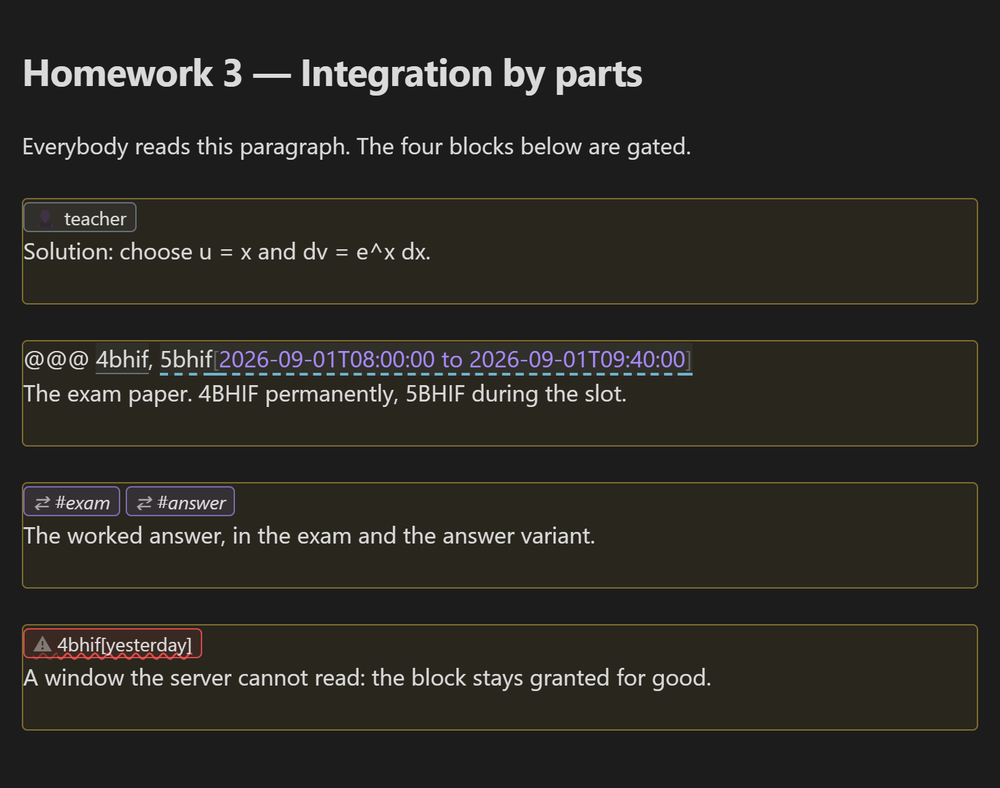
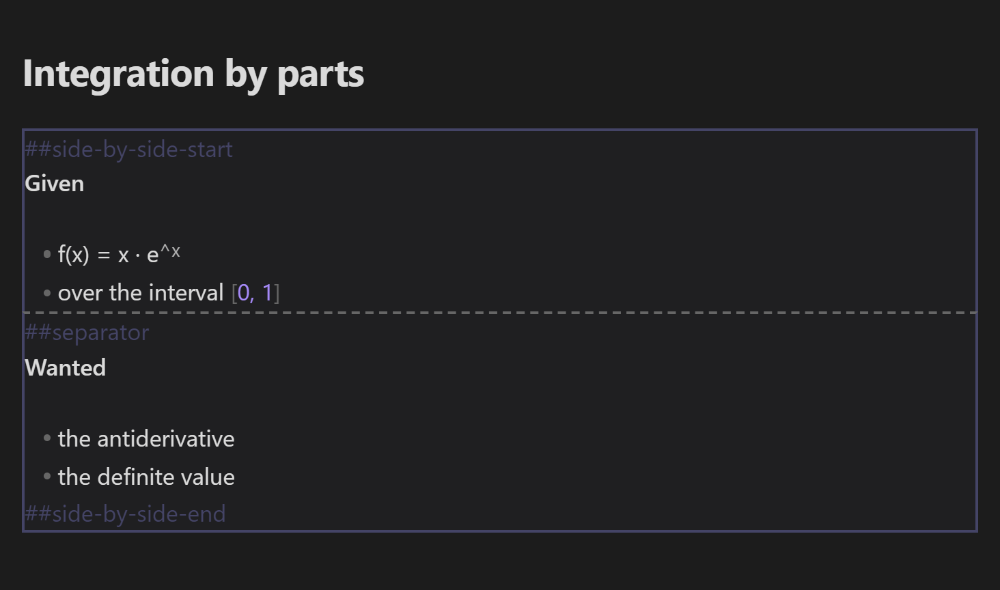

# Obsidian Extensions
Here you can find the technical intricacies of the Obsidian-specific language extension.

[Back](README.md) to the main page.
## The Obsidian Plugin
Everything on this page is a tag that instructs the server and that a reader never gets to see. **SafeLearn Formatter** is the companion plugin that shows you what the server will do with those tags *while you write them*. It changes nothing in your file, and it enforces nothing — every permission is still decided here, on the server.

It is an Obsidian community plugin with its own repository: [safeLearn-Obsidian-plugin](https://github.com/UnterrainerInformatik/safeLearn-Obsidian-plugin).
### Installing It
Settings → **Community plugins** → **Browse** → search for `SafeLearn Formatter` → **Install**, then **Enable**.

There is nothing to configure. No settings, no account, no network.
### It Writes The Tags For You
Right-click in the editor, or use the command palette. Both hold the same five commands, and each marker lands on a line of its own.


| Command | What it writes |
| --- | --- |
| **Insert side-by-side block** | Two columns. |
| **…with a chosen number of columns** | Asks how many, defaults to three. |
| **Insert fragment marker** | `##fragment` above the block the cursor is in. |
| **Insert a restricted section for each name** | One `@@@` block per name — paste a class list straight in. |
| **Restrict the selection to named readers** | Wraps what you selected in a directive. |
### It Shows A Restricted Block As A Block
The `@@@` line stands as the heading of the block it opens, and every entry in it is shown as what it is: a plain chip is a permanent grant, a dashed one carries a time window, a red one is a window the server **cannot read** (it drops the window and grants the block permanently — nothing else anywhere tells you), and an italic one is a view switch rather than an audience.


Put the cursor in that line and its own characters are back, editable, while every other block keeps its heading. Nothing is written into the document either way.



A directive on the [first line](docs-permissions.md) gates the whole file. It has no closing marker, so its frame is drawn with the lower edge left off.


In the reading view the tags are gone and the headings remain — which is close to what a reader who is allowed in will get.


### It Writes A Section Per Student
*Insert a restricted section for each name* takes a pasted class list and writes one block per person, each with a heading **inside** the block. A heading above it would stay on the page for everybody, so a document meant to show each student only their own section would show all of them the names of all the others.


`admin`, `teacher`, `teachers`, `student` and `students` are [reserved](docs-permissions.md): a display name equal to one of them is read as the role instead. The command writes your names unchanged and tells you when one of them was such a name.
### It Shows Fragments And Columns
A `##fragment` stands as an icon in the editor, and is its own characters again with the cursor in it.


A side-by-side block is drawn as the region it is while you write it, and rebuilt as the columns the server makes of it when you read it.




The plugin recognizes no more than the server does: its rules are taken from this project's own parser, and `npm run test:obsidian` runs both over the same tags — see [testing](docs-testing.md).
## Globally Unique File Names
Obsidian uses quick-links like so:
```markdown
# The next line will insert a link to a file.
[[md-file-name-without-extension]]

# The next line will insert an image.
![[image-file-name-with-extension]]
```
In order to be able to do that, you are not allowed to have two files with the exact same file-name within a vault. Even if they are located in different directories.
Same goes for images and other assets.
If you have two files, for example, named `test`, then you'll have to add the complete path in links to any of the two `test` files.

So plan your file-names carefully.
You'll be rewarded with a much faster and smoother editing-experience.
## Callouts
Contrary to GitHub or standard MD, Obsidian supports [callouts](https://help.obsidian.md/Editing+and+formatting/Callouts), which are basically colorfully rendered boxes with headings and content (cards, one might say).
Those look great, especially when dealing with long text-flow or when interspersing text with info-points or homework-reminders.

Examples:
```markdown
# A note.
> [!note]
> content
```


```markdown
# A Warning with 'BOO!' in the heading, instead of the default 'Warning'.
>[!warning] BOO!
>content
```


```markdown
# A collapsable callout
>[!tip]-
>content
```


```markdown
# A collapsable callout with 'some long text' as heading.
>[!quote]- some long text
>content
```


You get the idea.
You can see all the variations [here](https://help.obsidian.md/Editing+and+formatting/Callouts).

They all work with one exception:

## Image Sizing
The renderer will never touch the image's size, until it won't fit the display. If that occurs, it will just resize it proportionally to fit it.

To display images at a special size, you have the following options.
Those work on normal image-links, like the standard DM ones and the shortcut-links `Obsidian` provides.

```markdown
# Display in 200x200 pixels (x + 'x' + y)

# And as short-link
![[my-img.png|200x200]]

# Display in 200 pixels widths, sized proportionally

# And as short-link
![[my-img.png|120]]
```
## Fragments in Reveal.js
You may use fragments when starting a presentation.
Fragments are parts of you page that pop up one after another, step by step, when you're pressing the forward-button you normally press to advance to the next vertical page.
### Single Fragment Lines
The [Obsidian plugin](#the-obsidian-plugin) shows these while you write, and writes the marker for you.
You may mark single lines as Fragments. Those lines are denoted by having a `##fragment` in the line above them.
A single line is defined as from the start of a line to the next `newline`, so that may as well span more than a single line when line-breaks are inserted by the browser in order to fit that single line on the screen.
#### Single Fragment Example
```bash
This text displays already.
##fragment
Fragmented Text comes in after that.
- ##fragment one
- ##fragment two
```
Another example that fades in two blocks one after another would look like this:
```bash
This text is already on the page.
##fragment
- Then this
- fades in
##fragment
- and then
- these three
- lines
```
So you may see the `##fragment` tag as some kind of a `stop here and wait for me to press space` tag.
## Side-By-Side in Reveal.js
It's possible to make columns that only work when making a presentation in Reveal.js.
The [Obsidian plugin](#the-obsidian-plugin) draws the block while you write it and shows the columns when you read it.
You may denote a side-by-side number of columns this and every section (column) will then render side by side, from left to right. This enables you to fill a wide-screen with, let's say, an image and a table with an explanation besides it.
```bash
Normal text. Will be displayed centered.
##side-by-side-start
This text will be on the left side...
- one
- two
##separator
- three
- four

This will be on the right side
##side-by-side-end

and this will be below the side-by-side element on the bottom.
```
When watching the document in the normal HTML view those tags have no effect.
You can specify more than one separator resulting in more columns.