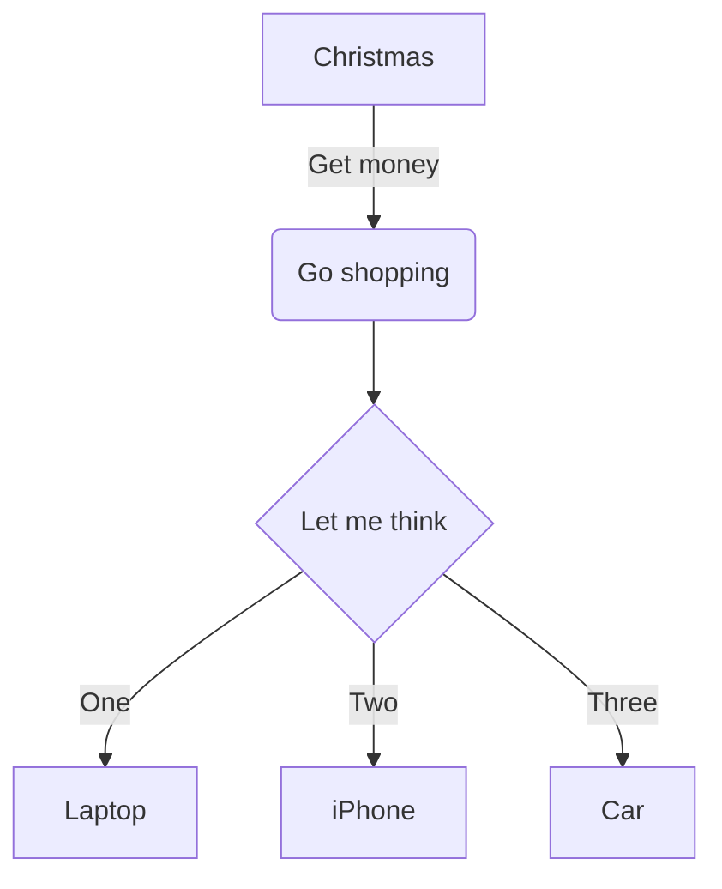

[[test-presentation]]
[[test-lernstrecke]]
[[test-fileperms-teachers]]
[[test-fileperms-4bhif-5bhif-2ahif]]
[[test-exam-practice-question]]
[[test - name - with - spaces]]
## Caption
This is a sample text...

## Tests for inline-permissions
@@@ teacher
Only visible to the teachers.
@@@
@@@ teacher, 4bhif
Only visible to 4bhif and teachers.
@@@
@@@ admin
Admins only!!!
@@@
@@@ 4bhif,5bhif, 4ahif
Special visibility (4bhif, 5bhif and 4ahif only)
@@@

### Tests for Time-Sensitive-Permissions
@@@ teacher[2099-01-01T08:00:00], 4bhif[2099-01-01T08:00:00 to 2099-01-01T12:00:00], 4ahif, examParticipant
This block demonstrates time-bound permissions. Teachers will see it starting on the morning of 1 Jan 2099, while 4BHIF only sees it until noon. 4AHIF has no timer and always sees it, as well as examParticipant.
@@@
@@@ teacher[2025-11-30T15:03:00]
**Time-Conditional FROM**
@@@
@@@ teacher[2025-11-30T15:03:00 to 2025-11-30T15:04:00]
**Time-Conditional FROM-TO**
@@@

## Test PlantUML
```plantuml
[hansi]
[Mama]
[Günter]
[Gerald]
hansi -> Mama
Mama -> Günter
Gerald -> Mama
Günter -> Gerald
```

## Test Mermaid


## Test Code Tags
```java
public class TestClass {
	private int myInt;
	private float myFloat;

	public int add(int a, int b) {
		return a + b;
	}
}
```

## Test Callouts
> [!Note]
> test

>[!Failure]  Sadly, no nesting as of now
>Due to parsing problems we cannot support callout-nesting for now.

>[!success] Heading
>Alternate heading.
>Fully customizable.

>[!success]- Extremely long title so that it will break. fwosiu efwuorh gwurhg aeuhbwauerh awueh buea hbihaweiubv e... Just to see where the chevron will be :)
>blah
>

>[!error]- collapsable
>You don't see this. lorem ipsum sdf uihweiufh iwruh glaiweruh gvöwau ervu aweöoruvheaöiou rfhgvaöwuregväou aweäviouha öweurihgviöuaewrhgvouwahe obvuh aäoüewuhfrb äoawure hbväoueah fövobuh aweourfhbv äoaweurb höoauewrhöboiuhea,

>[!note]

>[!abstract]

>[!info]

>[!todo]

>[!tip]

>[!success]

>[!question]

>[!warning]

>[!failure]

>[!danger]

>[!bug]

>[!Example]

>[!quote]

## Images
You may add images...
### Global Images (URL)
Add them using an absolute image-url like so:
`https://raw.githubusercontent.com/UnterrainerInformatik/java-http-server/master/docs/standard-request-response-process.png`
 

### Obsidian Link Images
![[Pasted image 20240315152828.png]]
### Local Images (path)
Add them using a relative path in your repository like so:
(The base of your path is the path of the current MD-file)
`assets/test-local-image.jpg`

Example:

## Other files treated like images by Obsidian
### PDF
![[Test.pdf]]
### Docx
![[Test.docx]]
## Lists And Fragments
### Lists
- one
- two
- three

>+ one
>+ two
>+ three

* one
* two
* three

>1. one
>2. two
>3. three
### Fragments
##fragment
Fragmented Text.
##fragment 
- one
- ##fragment two
 

##fragment
another text

## Second Fragment Test
Text
##fragment 
>- one ##fragment 
>- two ##fragment 
>- three ##fragment 

>+ one ##fragment 
>+ two ##fragment
>+ three ##fragment

Done.
## Side-By-Side
Normal text. Will be displayed centered.
##side-by-side-start
This text will be on the left side...
- one
- two
##separator
- three
- four

This will be on the right side
##side-by-side-end

and this will be below the side-by-side element on the bottom.
## Side-By-Side 3 Cols
Normal text. Will be displayed centered.
##side-by-side-start
This text will be on the left side...
- one
- two
##separator
- three
- four

This will be in the middle
##separator
- three
- four

This will be on the right side
##side-by-side-end

and this will be below the side-by-side element on the bottom.